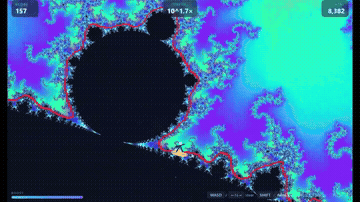
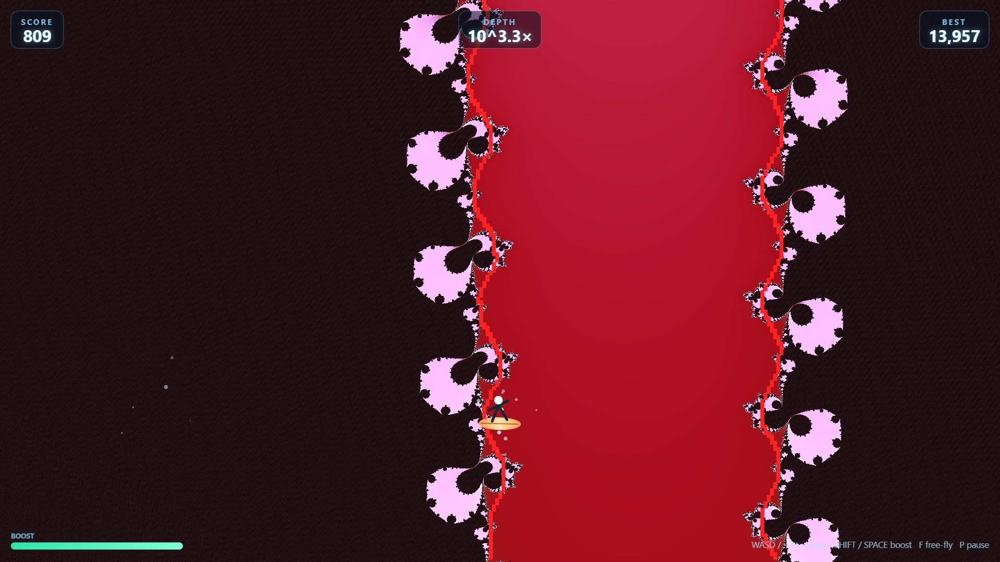
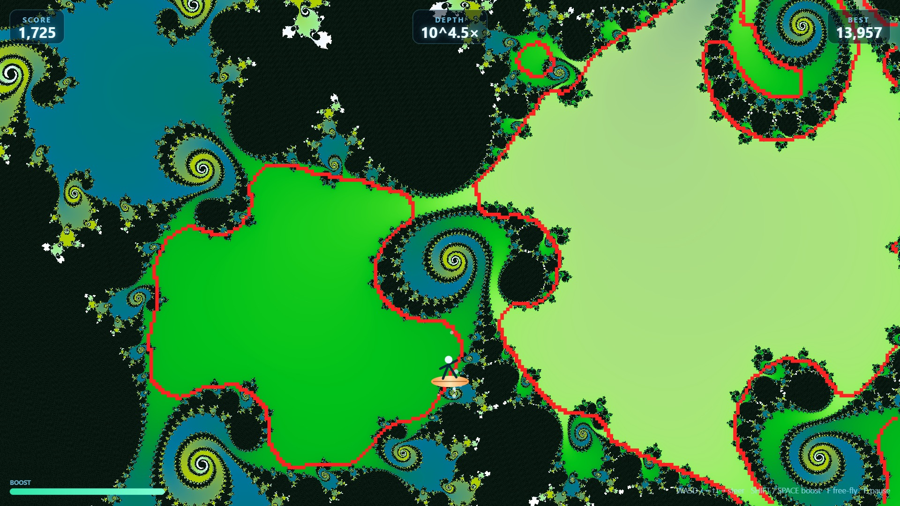

# Mandelsurf

A 2D surfing game played on a live, continuously zooming Mandelbrot set. The
game traces the fractal's actual coastline every frame (the red line) and
keeps your board glued to it while the camera dives in forever — steer along
the edge for score, or peel out to open water to catch your breath. There's
no way to lose; it's just an endless dive.



([full clip with sound](screenshots/gameplay.mp4) — GitHub doesn't play embedded video in READMEs, so this is a GIF preview; click through for the real thing)





Pure HTML/CSS/JS, no build step, no dependencies.

## Run it

Any static file server works, e.g.:

```bash
python -m http.server 8420
```

Then open `http://localhost:8420`. (Opening `index.html` directly via
`file://` also works in most browsers, but some browsers restrict local
script/module loading over `file://` — a local server is more reliable.)

## Controls

Keyboard only for now (PC-first):

| Key | Action |
| --- | --- |
| `↑` `↓` `←` `→` or `W` `A` `S` `D` | Steer your board in any direction |
| `Shift` or `Space` (hold) | Boost — faster and higher-scoring |
| `F` | Toggle free-fly — disables rim-snapping so you can reposition freely |
| `P` or `Esc` | Pause (with a restart option) |

Steering near real coastline is tangent-constrained to the boundary itself,
with a firm sideways snap keeping you glued to the nearest rim point, so you
can't wander off and get lost as long as the coastline is somewhere nearby.
Riding close to the edge (the glowing "foam") scores more than calm open
water; touching the black interior just costs you the foam bonus for a
moment, nothing worse. Press `F` at any time to disable that snapping and
fly freely in any direction — handy for lining up a jump to a different
part of the coastline; press it again to reconnect.

## Render quality

The menu (start screen and pause screen) has a RENDER QUALITY selector:

- **GPU (recommended)** — renders the fractal on your graphics card via
  WebGL, at full display resolution, using an emulated-double-precision
  shader. Sharper and faster than any CPU preset, since the whole screen is
  computed in parallel instead of pixel-by-pixel on one thread. Appears
  disabled with an explanation if your browser/device has no WebGL. (There's
  no CUDA/NVIDIA-specific path involved — WebGL is the standard,
  vendor-neutral way a web page reaches the GPU, whatever card you have.)
  Automatically hands back off to CPU rendering past very deep zoom, where
  the shader's precision trick runs out on some GPU/driver combinations, and
  resumes GPU rendering once shallow again.
- **Auto** — automatically balances internal CPU resolution against
  framerate. The fallback if GPU isn't available.
- **Low / Med / High / Ultra** — fixed CPU-rendered resolution presets, for
  when you want a specific fixed resolution instead of GPU or Auto.

Gameplay logic (the rim line, movement, collision) always runs on the same
CPU pipeline regardless of which renderer is on screen, so switching between
them is purely visual and never changes how the game plays.

There's also a PALETTE selector: **Classic** drifts color slowly over real
time, while **Depth Shift** slides the hue continuously as a function of
zoom depth (cycling through the full spectrum every couple of orders of
magnitude), so the same coastline looks completely different the deeper you
dive. Both screenshots above were taken with Depth Shift + GPU.

## How it works

- The fractal is recomputed every frame at a low internal resolution (scaled
  up smoothly) with an escape-time Mandelbrot renderer, colored with an ocean
  palette. Zoom increases continuously forever. The view never rotates —
  only translates (pans) and zooms.
- The actual coastline is extracted from that same per-pixel data: the
  inside/outside field is box-blurred (so the fractal's infinite fine detail
  reads as a smooth, rideable line rather than noise) and its 50% contour is
  traced into a set of rim points every frame — that's the red line. A
  second, lighter blur pass also catches filaments too thin to survive the
  main blur, so real structure you can actually ride never goes unmarked.
- Your board is drawn at a fixed screen position and never moves on screen —
  the world moves and zooms under it. Near real coastline, movement is
  constrained to the boundary's own local tangent (steering picks which way
  along it, forward or backward) and a firm sideways-only snap keeps you
  glued to the nearest rim point, so you can't drift off into open water or
  plunge blindly into rock. Both of those are safe from the classic "chasing
  a fresh nearest pixel every frame" jitter because the tangent is a
  *smoothed* heading, not a raw per-frame lookup.
- If no coastline is nearby at all (you've drifted into empty water), that
  constraint lifts: movement becomes fully free and directly responsive to
  your input, so you can actively steer back toward anything visible, and
  the zoom reverses to dive back out instead of digging deeper into nothing.
  Idle with no input, the board drifts back toward the run's starting point,
  guaranteed to be on a coastline.
- "How close to the edge" is measured with a proper distance estimator
  (tracking the escape-time derivative), not raw iteration count — iteration
  count is wildly nonlinear near a fractal boundary and makes for a useless
  gameplay signal.
- The optional GPU renderer runs the identical escape-time math in a GLSL
  shader, with each plane coordinate carried as a "double-single" pair of
  float32s (a value plus its rounding residual) instead of one native float
  — what a plain single-precision shader lacks, and why those band out at
  fairly shallow zoom. The depth-shift palette applies the same hue-rotation
  matrix (the classic CSS/SVG `hue-rotate` formula) on both the CPU and GPU
  paths, so the color stays identical across the automatic handoff between
  them.
- Zoom is limited by JS double precision (~1e12×). When a run hits that
  limit, it transitions to a fresh reef (a new curated coordinate) rather
  than ending the run — score and reef count keep accumulating.
